

<h1 align="center">Hi 👋, i'm Juan Ignacio 👨‍💻</h1>
<h2 align="center"> Full Stack Developer </h2>
<h2><strong>About me:</strong></h2>

 Full Stack Developer from <strong>Argentina 🇦🇷</strong>. Currently studying english 🤓 and looking for my first IT job 💪.
  Passionate about technology since I was little, I like coffee ☕ and playing video games 🎮.

&nbsp;
<h2 align="left"><strong>⭐ Languages and tools that I use </strong></h2>

            

&nbsp;

&nbsp;

<h2 align="center">📌 Projects I have worked on </h2>

&nbsp;

<h2 align="center"> Power Gym App </h2>
<h4> In this project, the objective is to provide a solution to a gym, which allows it to manage the different activities offered by it, generate user registration and associate with the available classes, collection of fees and memberships, added to this, also provide a service extra where the user is given information about specific diets for each case, some features are: </h4>

<ul>
<li>Login in which the user can log in or register.</li>
<li>Two roles in the app, administrator and user.</li>
<li>Footer with the contact and social networks of the gym.</li>
<li>Nav Bar with the different sections of the page.</li>
<li>Cart section.</li>
<li>Diet section exclusively for customers.</li>
<li>Gym activities section with their respective quotas, schedules and capacity.</li>
<li>Integrated payment gateway with Mercado Pago to manage class payments.</li>
<li>Section that includes the location of the selected gym branch through the Google Maps API. </li>
<li>Profile section where you can view the user's orders and leave reviews of the classes acquired.</li>
</ul>

  <a>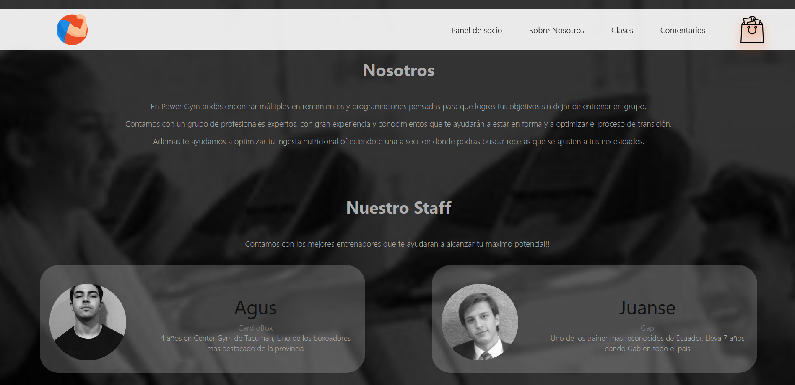</a>
  <a>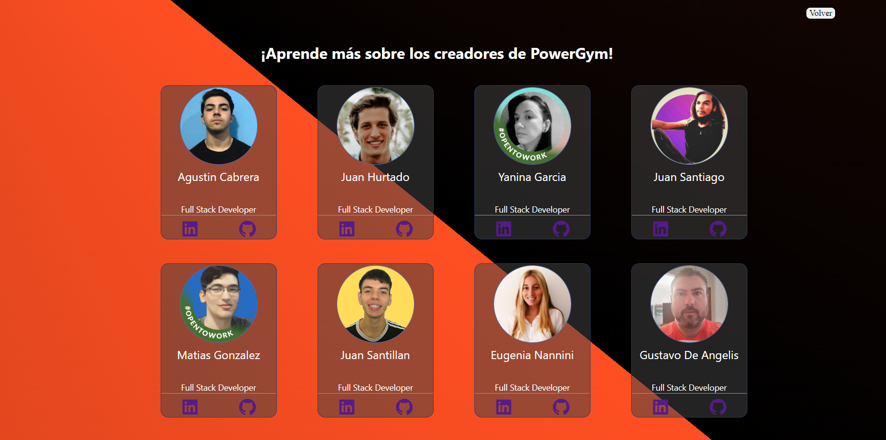</a>

  <a>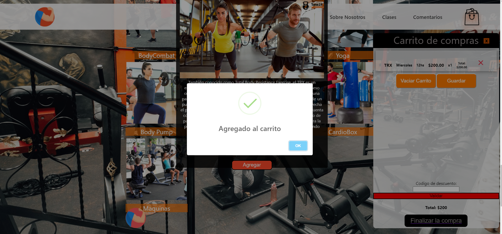</a>
  <a>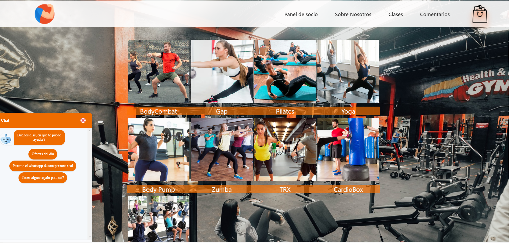</a>

  <a>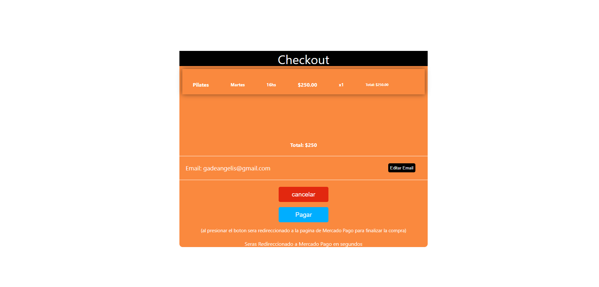</a>
  <a>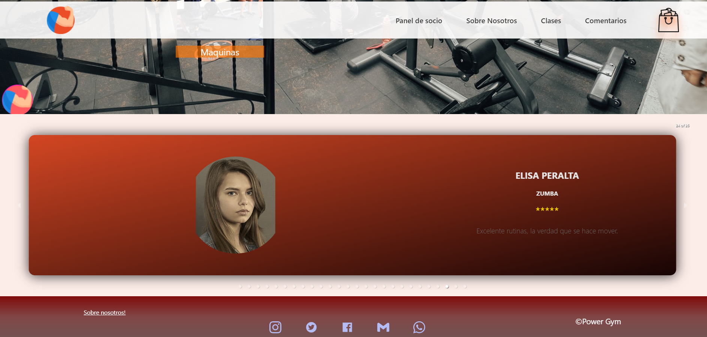</a>

  <a>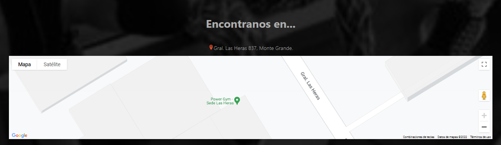</a>
  <a>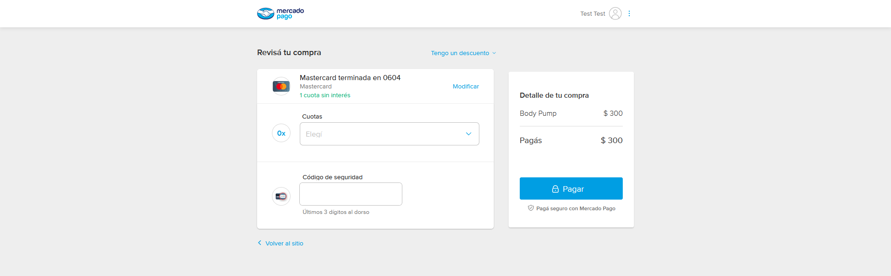 </a>

  <a>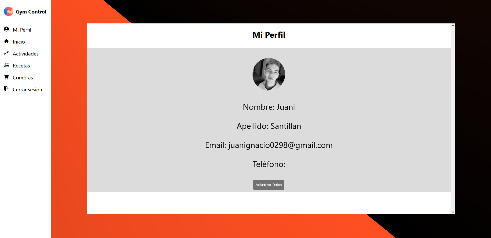</a>
  <a>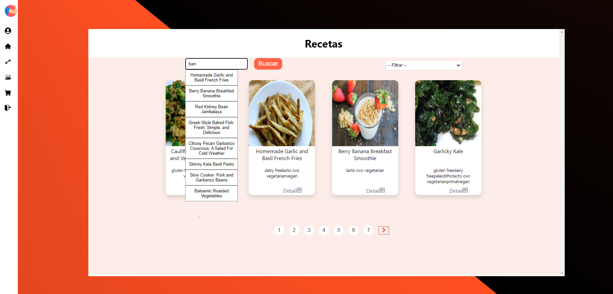</a>

 
        <a cursor="pointer" href="https://pgym-henry-final.vercel.app/">Ver deploy Web</a>
        <a cursor="pointer" href="https://github.com/agskbr/PF-Gym-Control-App"> Ver repositorio</a>

## Contributors

<h2 align="center"> World of Games App </h2>

<h4>SPA created during the Full Stack Developer bootcamp which, thanks to the RAWG API, allows obtaining the details of a particular video game out of +500,000 and adding new ones to a database. It also has a search bar, the possibility of sorting the video games displayed ascending or descending depending on their name or rating, and also being able to filter them by genre or origin (API or DB). PostgreSQL and Sequelize were used for the Database, Node.js and Express for the Backend and React.js accompanied by Redux for the FrontEnd with pure CSS.</h4>

  
  <a>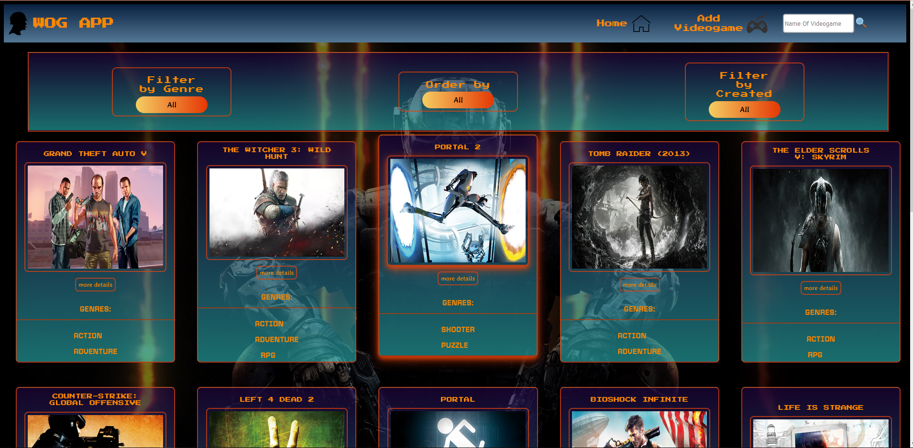</a>

  <a>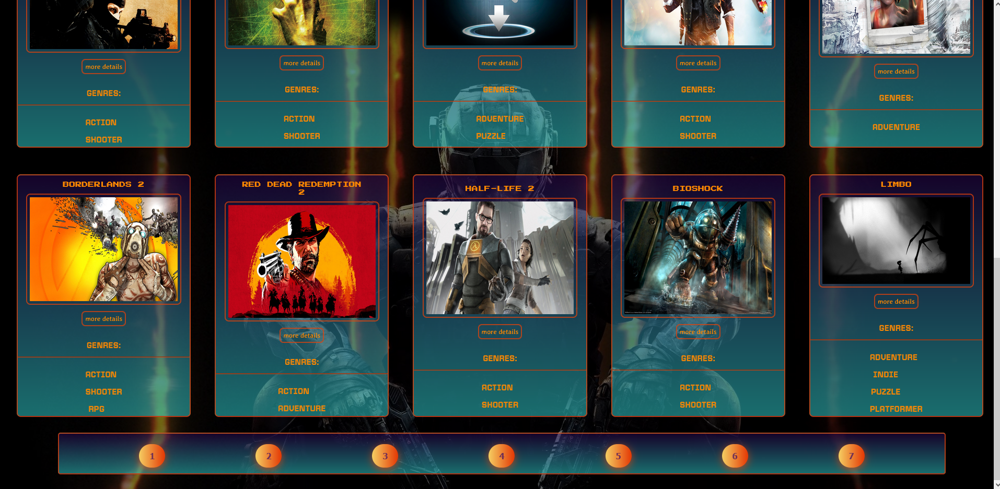</a>
  <a>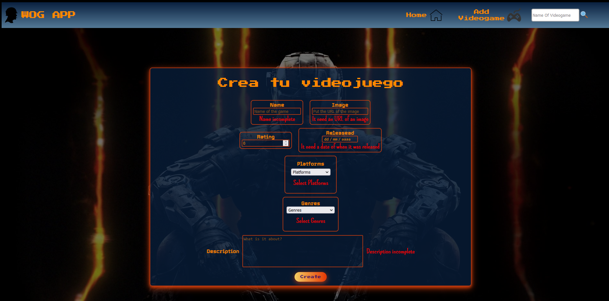</a>

  <a>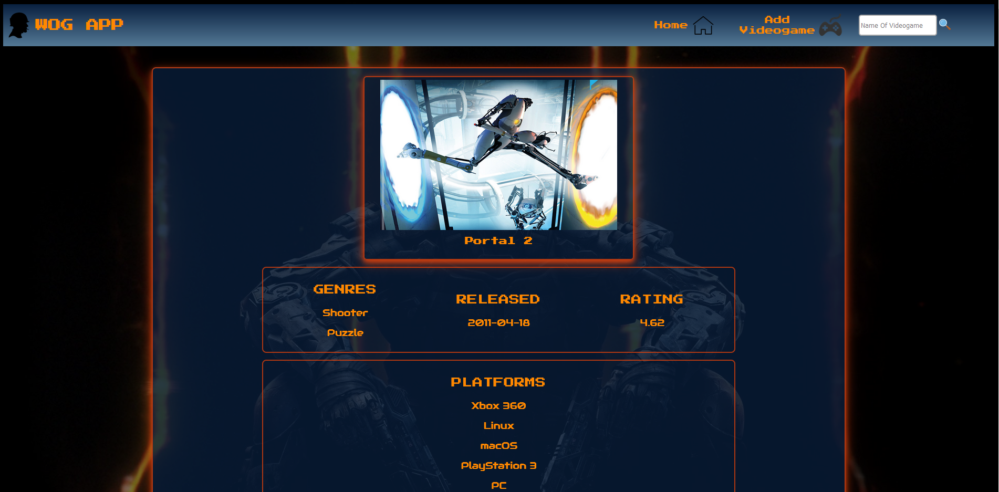</a>

 
        <a cursor="pointer" href="https://wog-app.vercel.app/">Ver deploy Web</a>
        <a cursor="pointer" href="https://github.com/juani029/PIVideoGames"> Ver repositorio</a>

<h1>📫 Contact: </h1>

    <a href="mailto:juanignacio0298@gmail.com" target="_blank" rel="noreferrer">juanignacio0298@gmail.com</a>

