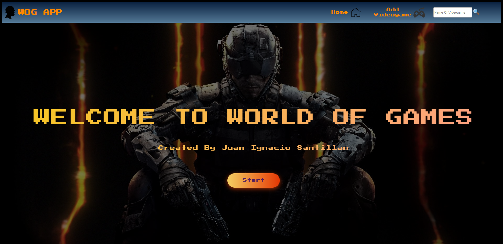

<h1 align="center">Hi 👋, i'm Juan Ignacio 👨‍💻</h1>
<h2 align="center"> Full Stack Developer </h2>
<h2><strong>About me:</strong></h2>

 Full Stack Developer from <strong>Argentina 🇦🇷</strong>. Currently studying english 🤓 and looking for my first IT job 💪.
  Passionate about technology since I was little, I like coffee ☕ and playing video games 🎮.

&nbsp;
<h2 align="left"><strong>⭐ Lenguajes y herramientas que manejo</strong></h2>

            

&nbsp;

&nbsp;

<h2 align="center">📌 Proyectos en los que he trabajado</h2>

&nbsp;

<h2 align="center"> Power Gym App </h2>
<h4> En este proyecto el objetivo es darle una solución a un gimnasio, la cual le permita gestionar las distintas actividades brindadas por el mismo, generar alta de usuarios y asociarse a las clases disponibles, cobro de cuotas y membresías, sumado a esto brindar además un servicio extra donde se le brinde información al usuario sobre dietas alimenticias específicas para cada caso, algunas funcionalidades son: </h4>

<ul>
<li>Login en la cual el usuario podrá iniciar sesión o registrarse.</li>
<li>Dos roles en la app, administrador y usuario.</li>
<li>Footer con el contacto y las redes sociales del gimnasio. </li>
<li>Nav Bar con las diferentes secciones de la página. </li>
<li>Sección de carrito. </li>
<li>
Sección de dietas alimenticias. </li>
<li>
Sección de actividades del gimnasio con sus respectivos cupos, horarios y capacidad. </li>
<li> Pasarela de pago integrada con Mercado Pago para gestionar los cobros de las clases.</li>
<li>
Sección en donde se incluye la localización de la sucursal del gym seleccionada a través de la API de Google Maps. </li>
<li>Sección de dietas basada en API externa de comida en donde el usuario puede obtener recetas en base a sus necesidades.</li>
<li>Sección de perfil donde se puede visualizar las órdenes del usuario, dejar reviews de las clases adquiridas</li>
</ul>

  
  

  
  

  
  

  
  

  
  

 
        <a cursor="pointer" href="https://pgym-henry-final.vercel.app/">Ver deploy Web</a>
        <a cursor="pointer" href="https://github.com/agskbr/PF-Gym-Control-App"> Ver repositorio</a>

## Contributors

<h2 align="center"> World of Games App </h2>

<h4>SPA creada durante el bootcamp de Full Stack Developer la cual gracias a la API RAWG permite obtener los detalles de un videojuego en particular de entre +500.000 y agregar nuevos a una base de datos. Cuenta además con una barra de búsqueda, la posibilidad de ordenar los videojuegos mostrados ascendente o descendentemente dependiendo de su nombre o rating y también la de poder filtrarlos por géneros o por origen (API o DB). Se uso PostgreSQL y Sequelize para la Base de datos, Node.js y Express para el Backend y React.js acompañado de Redux para el FrontEnd con CSS puro.</h4>

  
  

  
  

  

 
        <a cursor="pointer" href="https://wog-app.vercel.app/">Ver deploy Web</a>
        <a cursor="pointer" href="https://github.com/juani029/PIVideoGames"> Ver repositorio</a>

<h1>📫 Contacto</h1>

    <a href="mailto:juanignacio0298@gmail.com" target="_blank" rel="noreferrer">juanignacio0298@gmail.com</a>

